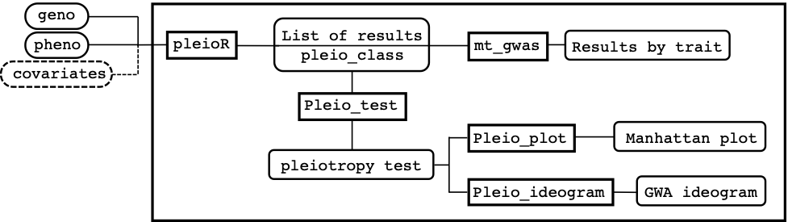
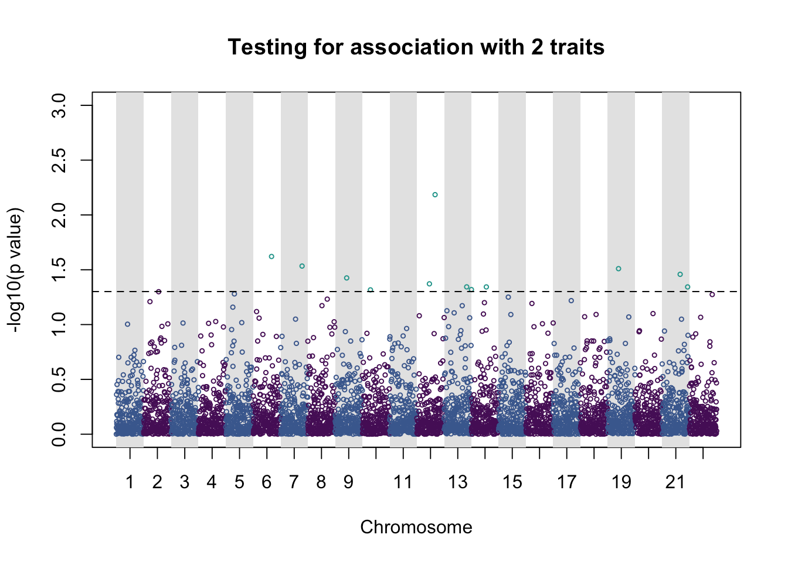
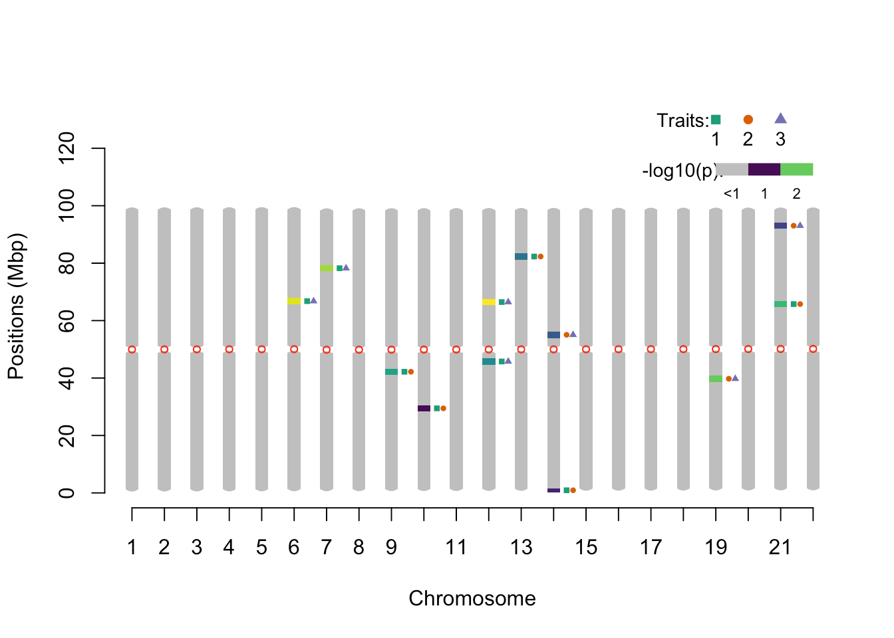

Pleiotest: A Multi-trait analysis and sequential test for detecting genetic pleiotropy
======================================================================================

pleiotest is a package that provides tools for detecting genetic associations with multiple traits (i.e. pleiotropy).

It performs a multi-trait genome-wide association analysis based on seemingly unrelated regressions. Results from this model are then used to run a sequential Wald test with some considerations to formally test for pleiotropic effects. 
The package offers some computational advantages that allows it to handle large and unbalanced data sets. In addition, it has functions and arguments to include covariates, subset the data, save the results or plot them.

**Figure 1** shows a schematic view of how the package is structured and how inputs, functions, and outputs are linked to each other on a conceptual pipeline. The main function pleioR() takes as input the phenotype (pheno) and genotype (geno) data, and possibly covariates (covariates). The results are returned in a list of class pleio_class. The pheno data consists of a dataframe that has IDs, traits, and observations arranged in columns. The geno data can be a numeric matrix or a memory-mapped matrix (e.g., a BEDMatrix object), with ID names in rows matching those in pheno. The package allows performing computations using subsets of the rows and columns in geno (see arguments i and j, for specifying rows and columns, respectively).
The results produced by pleioR() can be processed either by the mt_gwas() function, which returns trait-specific SNP-effect estimates, SE, and p-values from the multi-trait model; or by the pleio_test() function, which performs the sequential test for pleiotropy using Wald's test, and returns its p-values indicating which traits are associated with a particular variant. Finally, the functions pleio_plot() and pleio_ideogram() can be used to plot the results of pleio_test() with many arguments dedicated to fine-tuning.


**Figure 1.** Overview of the main functions of pleiotest.

Examples
--------

## pleiotest package:

Install package from github
```R
devtools::install_github('https://github.com/FerAguate/pleiotest')
```

Load the pleiotest package
```R
library(pleiotest)
```

This code creates a toy example of balanced data to test the functions

```R
# Set seed to obtain consistent results
set.seed(2020)
# Number of traits, individuals and SNPs
n_traits <- 3
n_individuals <- 10000
n_snps <- 5000
# Create pheno numeric matrix with traits in columns
pheno <- matrix(rnorm(n_traits * n_individuals), ncol = n_traits)
# Set names for the toy traits
colnames(pheno) <- c('tic', 'tac', 'toe')
# Create geno numeric matrix with SNPs in columns
geno <- sapply(1:n_snps, function(i) rbinom(n_individuals, 2, runif(1, 0.01, .49)))
# the row names of geno and pheno must be matching IDs
rownames(geno) <- rownames(pheno) <- paste0('ind', 1:n_individuals)
# Column names of geno can be rs SNP IDs
colnames(geno) <- paste0('rsid', 1:ncol(geno))
# The pleioR function takes a "melted" version of pheno
library(reshape2)
pheno_m <- melt(pheno)
```

## Analysis with pleioR

```R
pleio_object <- pleioR(pheno = pheno_m, geno = geno)
# To obtain by trait estimates of the multi-trait GWAS use mt_gwas
mt_result <- mt_gwas(pleio_object)
# head of the table with results for the 2nd trait named "tac"
head(mt_result$tac)
##       allele_freq     n     estimate         se    t value    p value
## rsid1     0.15385 10000  0.025388923 0.01987082  1.2776991 0.20138522
## rsid2     0.31165 10000 -0.016255002 0.01536892 -1.0576539 0.29023879
## rsid3     0.20340 10000 -0.012885285 0.01776105 -0.7254800 0.46817456
## rsid4     0.19305 10000  0.006495546 0.01829953  0.3549569 0.72262934
## rsid5     0.06330 10000 -0.063263043 0.02943708 -2.1490936 0.03165091
## rsid6     0.48515 10000  0.034642742 0.01431770  2.4195741 0.01555642
```

## Sequential test for pleiotropy

```R
pleio_results <- pleio_test(pleio_object)
# pleio_results is a list of p values, indices indicating traits in association, and labels for each index
head(pleio_results$pValues)
##               p1        p2        p3
## rsid1 0.57153601 0.8348181 0.7365110
## rsid2 0.75709168 0.9694093 0.9020807
## rsid3 0.63413382 0.7401637 0.7926364
## rsid4 0.93122594 0.9298004 0.8842012
## rsid5 0.15344613 0.7497386 0.6913278
## rsid6 0.09506335 0.7545318 0.9275524
```

```R
# If p1 in pValues is significant, ind1 indicates which is the associated trait
# If p2 in pValues is significant, ind2 indicates which are the two associated traits
head(pleio_results$Index)
##       ind1 ind2
## rsid1    2  2_3
## rsid2    2  1_2
## rsid3    1  1_2
## rsid4    1  1_2
## rsid5    2  2_3
## rsid6    2  2_3
```

```R
# Labels for traits
pleio_results$traits
##     1     2     3 
## "tic" "tac" "toe"
```

It's possible indexing SNPs and individuals in geno (useful when running in parallel)

```R
# Here we index 2 SNPs and 50% of individuals in geno
pleio_object2 <- pleioR(pheno = pheno_m, geno = geno,
                           i = sample(x = seq_len(nrow(geno)), size = nrow(geno) * .5),
                           j = 1:2)
# Use save_at to save results in a folder. 
mt_result2 <- mt_gwas(pleio_object2, save_at = '~/Documents/')
# This creates a file named mt_gwas_result_x.rdata
file.exists('~/Documents/mt_gwas_result_1.rdata')
## [1] TRUE
```

```R
pleio_result2 <- pleio_test(pleio_object2, save_at = '~/Documents/')
# results will be saved in pleio_test_result_x.rdata
file.exists('~/Documents/pleio_test_result_1.rdata')
## [1] TRUE
```

```R
# p values of the indexed SNPs
head(pleio_result2$pValues)
##              p1        p2        p3
## rsid1 0.9075541 0.9603990 0.9656137
## rsid2 0.5550206 0.8964516 0.9885700
```

pleioR can also deal with unbalanced data

```R
# sample 10% of data to remove
missing_values <- sample(1:nrow(pheno_m), round(nrow(pheno_m) * .1))
pheno_m2 <- pheno_m[-missing_values,]
# The randomly generated unbalance created the following sub-sets:
identify_subsets(trait = pheno_m2$Var2, id = pheno_m2$Var1)[[1]]
##      tic tac toe    n
## [1,]   0   0   1   78
## [2,]   0   1   0   83
## [3,]   0   1   1  865
## [4,]   1   0   0   80
## [5,]   1   0   1  816
## [6,]   1   1   0  801
## [7,]   1   1   1 7265
```

Fit the model with unbalanced data

```R
# It's possible to drop sub-sets with less than x observations (drop_subsets = x)
pleio_object3 <- pleioR(pheno = pheno_m2, geno = geno, drop_subsets = 200)
# to save computation time, stop the sequence for p-values larger than loop_breaker (useful when there are many traits)
system.time({pleio_result3 <- pleio_test(pleio_object3, loop_breaker = .99)})
##    user  system elapsed 
##   0.095   0.009   0.194
system.time({pleio_result3 <- pleio_test(pleio_object3, loop_breaker = .05)})
##    user  system elapsed 
##   0.069   0.006   0.108
system.time({pleio_result3 <- pleio_test(pleio_object3, loop_breaker = .01)})
##    user  system elapsed 
##   0.068   0.005   0.101
```

It's also possible to add covariates (optional)

```R
covariates <- matrix(rnorm(n_individuals * 3, 1, 2), ncol = 3)
rownames(covariates) <-  rownames(geno)
pleio_object4 <- pleioR(pheno = pheno_m2, geno = geno, covariates = covariates)
pleio_result4 <- pleio_test(pleio_object4)
head(pleio_result4$pValues)
##               p1        p2        p3
## rsid1 0.86895769 0.9991740 0.9991740
## rsid2 0.91879048 0.9501436 0.9906203
## rsid3 0.59522204 0.7420609 0.7877645
## rsid4 0.95764709 0.9662184 0.9203587
## rsid5 0.04954071 0.8614637 0.9292794
## rsid6 0.33845817 0.5378474 0.5188060
```

## Plot results

Plotting the results of pleio_test using base pair and centromeres positions

Create toy base pair positions and centromere positions
```R
bp_positions <- data.frame('chr' = rep(1:22, length.out = nrow(pleio_result4[[1]])), 
                           'pos' = seq(1, 1e8, length.out = nrow(pleio_result4[[1]])), 
                           row.names = rownames(pleio_result4[[1]]))
centromeres = aggregate(pos ~ chr, data = bp_positions, FUN = function(x) mean(x) / 1e6)
```

```R
# The function pleio_plot also returns a table with the significant SNPs
pleio_plot(pleio_res = pleio_result4, n_traits = 2, alpha = .05, bp_positions = bp_positions, chr_spacing = 1000)
##              p_value index chr         bp
## rsid3350 0.023926931   1_3   6  566398274
## rsid3923 0.029255949   1_3   7  677741542
## rsid2121 0.037541551   1_2   9  840576107
## rsid1484 0.048251198   1_2  10  927274445
## rsid2300 0.042500308   1_3  12 1142479484
## rsid3334 0.006532188   1_3  12 1163163621
## rsid4127 0.045298928   1_2  13 1278467680
## rsid14   0.047962815   1_2  14 1295632113
## rsid2742 0.045343474   2_3  14 1350203026
## rsid1999 0.030899586   2_3  19 1832544489
## rsid3299 0.034798696   1_2  21 2057431463
## rsid4663 0.045350685   2_3  21 2084716920
```

```R
# The function pleio_ideogram also returns a table with the plotted regions
pleio_ideogram(pleio_res = pleio_result4, n_traits = 2, alpha = .05, bp_positions = bp_positions, window_size = 1e6, centromeres = centromeres, set_ylim_prop = 1.3)
##    chr     lower     upper nSNP    min_pval      SNP traits
## 1    6 65.673133 67.873574    1 0.023926931 rsid3350    1_3
## 2    7 77.135426 79.335866    1 0.029255949 rsid3923    1_3
## 3    9 41.088217 43.288657    1 0.037541551 rsid2121    1_2
## 4   10 28.345668 30.546108    1 0.048251198 rsid1484    1_2
## 5   12 44.668933 46.869373    1 0.042500308 rsid2300    1_3
## 6   12 65.353069 67.553510    1 0.006532188 rsid3334    1_3
## 7   13 81.216242 83.416682    1 0.045298928 rsid4127    1_2
## 8   14  0.260052  1.580316    1 0.047962815   rsid14    1_2
## 9   14 53.950789 56.151229    1 0.045343474 rsid2742    2_3
## 10  19 38.647729 40.848169    1 0.030899586 rsid1999    2_3
## 11  21 64.652929 66.853370    1 0.034798696 rsid3299    1_2
## 12  21 91.938386 94.138826    1 0.045350685 rsid4663    2_3
```

